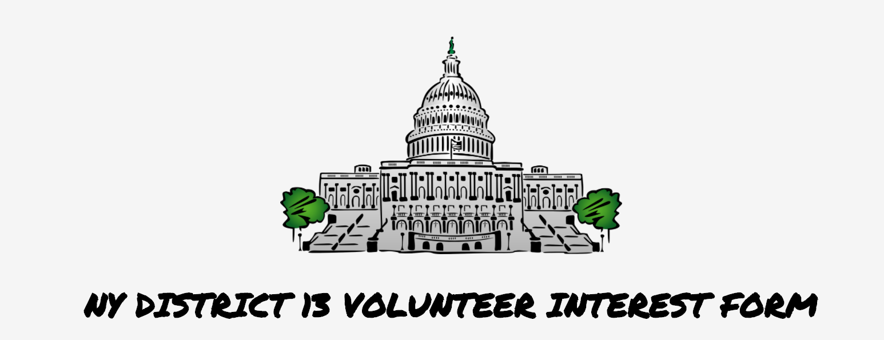

## Tuesday Strategies Code Challenge

Notes:

I read the code challenge quite a few times. It left a bit of room for interpretation. Therefore, I broke the problem into smaller pieces. 

I started by building out my app from scratch, and getting the server up and running. Then I used `sequelize-cli` to create the models.

After the models were created began building out the front end. The code challenge asked that the volunteer's location be checked agains the voter list to see if they are in the district. In the case of my app, I used NY District 13, my district as a test case. 

I used `geolocation` to get the location of the browser, and to store that into state. I used another package, that translated the latitude and longitude from the `geolocation` into closest city name, and I stored that in state as well. 

On my model, I used a virtual field to populate the full name from the first name, middle initial, and last name that we collected from the potential volunteer. 

The age is calculated from the given birthday, and all of the results were posted into the database. 

There is a chance that the material-ui will throw an error regarding postCSS - If that does occur you only need to restart the server and reload the app in the browser to be able to bundle the file. Unfortunately, material-ui was working correctly until I installed a package I had never used before.

The last remaning price was the database table comparison, and while I did not have that before 9pm tonight (9/10/17) - I will be completing this code challenge, for my own price of mind - including the PostCSS material-ui error. 

Thank you Tuesday Stategies for giving me the chance to do a code challenge for you.

All the best, Ormabe